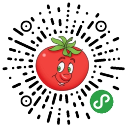
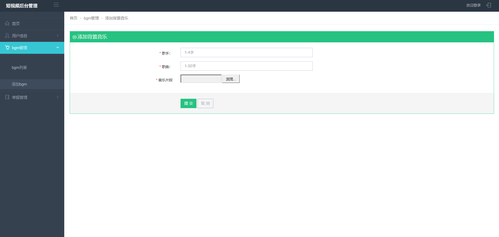
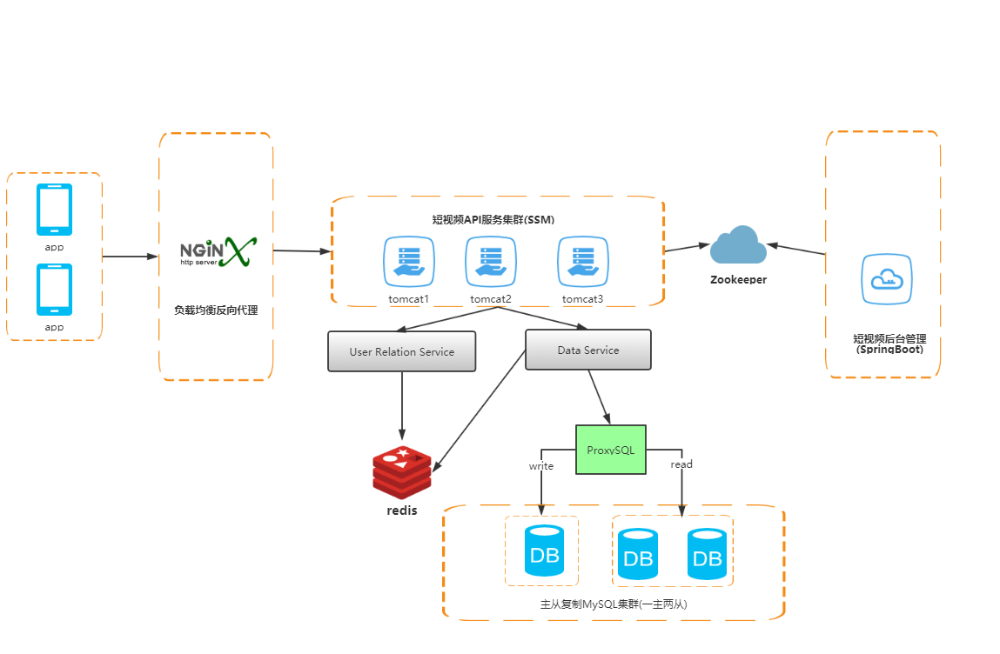
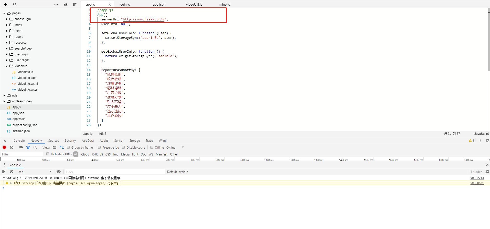

⭐⭐⭐⭐番茄短视频-后台管理系统🙋基于SpringBoot搭建🐓 关键字：SSM、springboot、分布式、前后端分离、云部署、Zookeeper、redis
#
<h2>☁️线上版(备案中......)</h2>

<blockquote>

简介：基于风口飞起的两只"小猪🐖"——小程序+短视频,该项目是一款基于微信小程序端的视频社交软件,并且采用腾讯云的服务器进行分布式的部署~~~

小视频后台管理系统 —— 主要实现了用户的管理，短视频的管理，背景音乐的管理，权限验证，单点登陆。

微信小程序端 —— 短视频社交小程序，用户可以在小程序上发布自己的短视频，并且经过我们的平台加入滤镜（功能暂未上线）或者背景音乐制作出独具特色的短视频。实现了点赞、评论、下载、分享、转发（接口未开放）等功能。

微信小程序API的后台Github地址：https://github.com/oyjcodes/wx-videos-api

微信小程序前端APP的Github地址：https://github.com/oyjcodes/wx-video-client

</blockquote>

<h2>💡小程序端展示</h2>

<h2>💻后台管理系统页面展现</h2>

<h2>🔧相关技术</h2>
 
前端:h5+css+javascript+jquery+bootstrap+themeleaf

 
后端:springboot+mybatis+mysql

 
组件:bootsrap-table,webUploader,pagehelper+layer

 
项目部署: docker + linux

 
中间件:zookeeper(分布式)

 
测试:swagger2,postman

 
开发风格：分布式系统架构，前后端分离开发风格，RESTful api

 <h2>📝需求分析</h2>
 
用户需求
 
 
用户个人信息管理，视频的编辑（加入滤镜或者背景音乐）、上传、浏览、点赞、关注、下载、等功能。

 
管理员需求

 
用户管理、视频管理（对违违法视频进行审核操作）、背景音乐管理（对音乐库中音乐的增删改查、通过zookeper与小程序前台进行交互）等
 
 

  
<h2>✏️项目设计</h2>
<h3>微信小程序端</h3>

前台的设计、后台的管理、安全性

前端：基于微信小程序的开发文档

后端：基于springboot   +   mysql数据库  +  redis缓存数据库  +  ffmpeg + zookeeper

组件：wxsearch微信小程序搜索组件

<h3>后台管理系统端</h3>

后台管理系统的开发、安全性

mybatis 数据持久层框架

网站前端：bootstrap前端框架 + javascript + css +html +jquery +ajax+themeleaf模板引擎 

短视频：审核、删除

背景音乐：添加和修改

管理员管理：用户管理、视频访问量、点击率的记载分析(开发中......)

 

<h2>☕️系统架构</h2>

<h2>🍉Tip</h2>

将wx-videos-client小程序页面导入到微信开发工具栏中,并且在app.json文件中修改serverUr服务器地址

如需使用本地api需要部署wx-videos-dev项目（项目以war包发布，需要额外配置tomcat环境）

关于后台管理系统 导入wx-videos-admin项目

关于分布式zookeeper环境配置，观看相关的配置文件即可

 
 
 <h2>🔎技术栈</h2>
 <h3>JAVA后端</h3>

<table>
<thead>
<tr>
<th>名称</th>
<th>描述</th>
<th>官网</th>
</tr>
</thead>
<tbody>
<tr>
<td>Spring Framework</td>
<td>容器</td>
<td><a href="http://projects.spring.io/spring-framework/" rel="nofollow">http://projects.spring.io/spring-framework/</a></td>
</tr>
<tr>
<td>SpringMVC</td>
<td>MVC框架</td>
<td><a href="http://docs.spring.io/spring/docs/current/spring-framework-reference/htmlsingle/#mvc" rel="nofollow">http://docs.spring.io/spring/docs/current/spring-framework-reference/htmlsingle/#mvc</a></td>
</tr>
<tr>
<td>MyBatis</td>
<td>ORM框架</td>
<td><a href="http://www.mybatis.org/mybatis-3/zh/index.html" rel="nofollow">http://www.mybatis.org/mybatis-3/zh/index.html</a></td>
</tr>
<tr>
<td>MyBatis Generator</td>
<td>代码生成</td>
<td><a href="http://www.mybatis.org/generator/index.html" rel="nofollow">http://www.mybatis.org/generator/index.html</a></td>
</tr>

<tr>
<td>SpringBoot</td>
<td>快速开发框架</td>
<td><a href="https://spring.io/projects/spring-boot/" rel="nofollow">https://spring.io/projects/spring-boot/</a></td>
</tr>

<tr>
<td>Druid</td>
<td>数据库连接池</td>
<td><a href="https://druid.apache.org/" rel="nofollow">https://druid.apache.org/</a></td>
</tr>

<tr>
<td>Redis</td>
<td>缓存数据库</td>
<td><a href="https://redis.io/" rel="nofollow">https://redis.io/</a></td>
</tr>

<tr>
<td>Zookeeper</td>
<td>分布式应用程序协调服务</td>
<td><a href="https://zookeeper.apache.org/" rel="nofollow">https://zookeeper.apache.org/</a></td>
</tr>

<tr>
<td>FFmpeg</td>
<td>音视频工具</td>
<td><a href="http://ffmpeg.org/" rel="nofollow">http://ffmpeg.org/</a></td>
</tr>

<tr>
<td>PageHelper</td>
<td>MyBatis分页</td>
<td><a href="http://git.oschina.net/free/Mybatis_PageHelper" rel="nofollow">http://git.oschina.net/free/Mybatis_PageHelper</a></td>
</tr>

<tr>
<td>Maven</td>
<td>项目构建管理</td>
<td><a href="http://maven.apache.org/" rel="nofollow">http://maven.apache.org/</a></td>
</tr>

<tr>
<td>Swagger</td>
<td>文档工具</td>
<td><a href="https://swagger.io/" rel="nofollow">https://swagger.io/</a></td>
</tr>

<tr>
<td>应用容器引擎</td>
<td>Docker</td>
<td><a href="https://www.docker.com/" rel="nofollow">https://www.docker.com/</a></td>
</tr>

<tr>
<td>数据库中间件</td>
<td>ProxySQL</td>
<td><a href="https://www.proxysql.com/" rel="nofollow">https://www.proxysql.com/</a></td>
</tr>

<tr>
<td>反向代理服务器</td>
<td>Nginx</td>
<td><a href="http://nginx.org/" rel="nofollow">http://nginx.org/</a></td>
</tr>

<tr>
<td>MySQL</td>
<td>数据库</td>
<td><a href="https://www.mysql.com/" rel="nofollow">https://www.mysql.com/</a></td>
</tr>
<tr>
<td>Tomcat 7.0</td>
<td>服务器</td>
<td><a href="http://tomcat.apache.org/" rel="nofollow">http://tomcat.apache.org/</a></td>
</tr>
</tbody>
</table>
 
<h3>前端</h3>
<table>
<thead>
<tr>
<th>名称</th>
<th>描述</th>
<th>官网</th>
</tr>
</thead>
<tbody>
<tr>
<td>jQuery</td>
<td>函数库</td>
<td><a href="http://jquery.com/" rel="nofollow">http://jquery.com/</a></td>
</tr>
<tr>
<td>Bootstrap</td>
<td>前端框架</td>
<td><a href="http://getbootstrap.com/" rel="nofollow">http://getbootstrap.com/</a></td>
</tr>
<tr>
<td>Bootstrap-table</td>
<td>数据表格</td>
<td><a href="http://bootstrap-table.wenzhixin.net.cn/" rel="nofollow">http://bootstrap-table.wenzhixin.net.cn/</a></td>
</tr>
<tr>
<td>echarts</td>
<td>图表</td>
<td><a href="http://echarts.baidu.com/" rel="nofollow">http://echarts.baidu.com/</a></td>
</tr>
<tr>
<td>jqGrid</td>
<td>前端分页组件</td>
<td><a href="http://www.trirand.com/blog/jqgrid/jqgrid.html" rel="nofollow">http://www.trirand.com/blog/jqgrid/jqgrid.html</a></td>
</tr>
<tr>
</tbody>
</table>
 

<h2>🔥写在最后的话</h2>
✌✌✌✌✌✌✌学习的过程是"痛并快乐着"~~~~~✌✌✌✌✌✌✌✌✌✌

